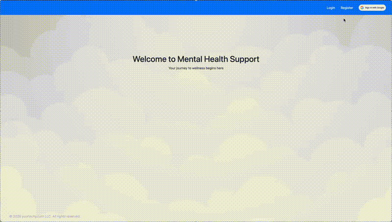

# Mental Health Support Application

The Mental Health Support Application is a web-based platform designed for users to assess and track their mental well-being.  It offers valuable mental health insights by either integrating with external machine learning services like Google Cloud Vertex AI or functioning independently with its own built-in model deployment pipeline.

<p align="center">
  
</p>

---

## Table of Contents
- [Overview](#overview)
- [Project Structure](#Project-Structure)
- [Getting Started](#Getting-Started)
- [Contributing](#contributing)
- [License](#license)

---

## Overview

This project contains the Front-End Application for the Mental Health Prediction Model, designed as the UI component of the Capstone Project.

### Related Repositories & Documentation:

- **GCP Deployment:** The model inference and infrastructure deployment. See: [GCP Implementation Repository](https://github.com/judesantos/ml_mentalhealth_gcp.git).
- **Project Implementation:** The core machine learning pipeline and model training are available in: [Data Science/ML Project](https://github.com/judesantos/Springboard_DS_ML/tree/main/SpringBoard-DSC_Capstone_Project_3).
- **Project Proposal (UI Section):** The front-end design and functionality are outlined in: [Mental Health Prediction Proposal](SpringBoard-DSC_Capstone_Project_3/Final_Capstone_Mental_Health_Prediction_App.pdf).
- **Capstone Project Final Report:** Detailed model development reports are documented in: [Mental Health Prediction Final Report](https://github.com/judesantos/Springboard_DS_ML/blob/main/SpringBoard-DSC_Capstone_Project_3/Final_Capstone_Mental_Health_Report.pdf) 

This front-end application serves as the user interface for interacting with the model, allowing users to input relevant data and receive predictions. It integrates with the back-end services hosted on GCP to provide real-time mental health predictions. 

It can also be configured as a stand-alone application, as it includes a built-in training pipeline and inference services.

While the current implementation uses an **XGBoost model**, the application is **model-agnostic**—meaning it can be extended to support other machine learning frameworks (e.g., TensorFlow, PyTorch, Scikit-learn) with minimal modifications.

### **Key Features**
- 🌍 **User-Friendly Interface**: Intuitive and accessible UI for desktop and mobile users.
- 🔐 **Secure Authentication**: Supports user registration and login.
- 📊 **AI-Powered Predictions**:
  - **Remote Inference**: Connects to **external ML endpoints** (e.g., **Vertex AI** in [`ml_mentalhealth_gcp`](https://github.com/judesantos/ml_mentalhealth_gcp)).
  - **Local Model Execution**: Runs in **standalone mode** when configured with an embedded model.
- 🔄 **Model-Agnostic Design**: Supports various ML frameworks; additional models can be integrated.
- ☁️ **Cloud-Native Deployment**: Deployable via **Google Cloud Platform (GCP)** with **Vertex AI and Kubernetes (GKE)**.
- 🚀 **Automated CI/CD Pipeline**: Uses **Terraform-based automation** for fully automated deployment and updates.

### **Architecture Overview**
The application follows a **flexible inference architecture**:
1. **Frontend**: A web-based interface for user interactions.
2. **Backend API**:
   - Routes user inputs to **ML inference endpoints** (e.g., Vertex AI).
   - Supports **standalone execution** for models deployed locally.
3. **ML Integration**:
   - Connects to **Vertex AI model endpoints** for cloud-based predictions.
   - Allows embedding locally deployed models for **offline predictions**.
4. **Cloud Infrastructure**:
   - Provisioned via **Terraform** for reproducible deployments.
   - Runs on **GKE, Cloud Run, or standalone Docker containers**.

### **Deployment Modes**
This application can be deployed in two primary configurations:
1. **Cloud-based Inference**:
   - Uses **Vertex AI endpoints** for model predictions.
   - Managed as part of the [`ml_mentalhealth_gcp`](https://github.com/judesantos/ml_mentalhealth_gcp) pipeline.
2. **Standalone Execution**:
   - Runs locally with an embedded ML model.
   - Requires **manual integration** for additional models.

### **Extensibility**
- 🛠 **Custom Model Integration**: Developers can add support for new ML models by modifying the backend API.
- 🔄 **Hybrid Deployment**: Supports both **cloud-based inference** and **local execution**.
- 📦 **Dockerized Setup**: Ensures portability and scalability.

### Tools

The **ML Mental health** application is built on top of [ML CI/CD](https://github.com/judesantos/ml_ci_cd.git), a CI/CD framework built with a development workflow that uses tools and frameworks to optimize scalability, maintainability, and high-quality software practices.

For additional information about the tools and technologies used, see: [ML CI/CD](https://github.com/judesantos/ml_ci_cd.git).

---

## Project Structure
```
├── .env-development                            # Application environment variables (create a .env copy)
├── .github                                     # Git actions - For CI/CD code checker step
│   ├── actions
│   │   └── build_app
│   │       └── action.yml
│   └── workflows
│       └── lint.yml
├── .gitignore
├── Dockerfile                                  # Dockerized app deployment
├── Makefile                                    # Command line interface used for linting, build, setup, testing
├── README.md
├── app                                         # Backend services: Model training, deployment, inference service
│   ├── app_main.py
│   ├── ml
│   │   ├── config
│   │   │   ├── db.py
│   │   │   ├── gcp.py
│   │   │   ├── logging.py
│   │   │   └── model.py
│   │   ├── gcp_endpoint.py
│   │   └── model
│   │       ├── model_builder.py
│   │       ├── model_inference.py
│   │       ├── pipeline
│   │       │   ├── collection.py
│   │       │   ├── preparation.py
│   │       │   └── xgb_model.py
│   │       └── schema
│   │           └── ml_features.py
│   ├── model_inference_main.py
│   ├── model_train_main.py
│   └── web                                      # Application user interface
│       ├── app.py                               # Flask instantiation, configuration
│       ├── extensions.py
│       ├── models
│       │   ├── mental_health.py
│       │   ├── mental_health_inference.py
│       │   ├── user.py
│       │   └── user_inference_log.py
│       ├── routes                               # Application web routes: authentication, prediction
│       │   ├── auth.py
│       │   └── main.py
│       ├── settings.py
│       ├── static                               # Front-end display: Includes JS frameworks, css
│       │   ├── css
│       │   │   ├── bootstrap.min.css
│       │   │   └── styles.css
│       │   └── js
│       │       ├── bootstrap.bundle.min.js
│       │       ├── bootstrap.min.js
│       │       ├── popper.min.js
│       │       ├── sdfsdfbootstrap.bundle.min.js.map
│       │       └── sdfsdfpopper.min.js.map
│       └── templates                           # Front-end display, redirects, forms
│           ├── base.html
│           ├── error.html
│           ├── evaluation.html
│           ├── home.html
│           ├── login.html
│           ├── report.html
│           ├── signup.html
│           └── ui
│               ├── forms
│               │   ├── login_form.py
│               │   ├── ml_input_form.py
│               │   └── signup_form.py
│               └── ml_features.py
├── certs                                       # SSL Certificates deployment path
├── data                                        # CSV data deployment path
├── environment.yml                             # Conda development environment
├── logs                                        # Application logs path
├── models                                      # Pipeline artifacts: serialized model path
├── notebooks                                   # Developer notebooks. Pre-deployment files
│   ├── pgsql_import.ipynb
│   └── random_forest_model.ipynb
├── requirements.txt                            # Application deployment environment
└── setup.cfg                                   # flake8 linting configuration file
```

---

## Getting Started

1. **Clone the repository**:
    ```bash
    git clone git@github.com:judesantos/ml_mentalhealth_app.git
    cd ml_mentalhealth_app
    ```

2. **Set up environment variables**:
    - Copy the `.env-example` file to `.env` and update the variables as needed:
    ```bash
    cp .env-example .env
    ```

2. **Initialize the database**:
    - Create a PgSql Database named `ml_mental_health`
    ***TODO: automate setup***

4. **Install the necessary dependencies**:
    ```bash
    # Install python environment `ml_ci_cd` with required packages
    conda env create -f environment.yml
    # Activate environment: ml_ci_cd
    conda activate ml_ci_cd
    ```
5. **Copy a valid SSL Certificate files
    - Must be a certificate and private key with a .pem extension
    - For the development environment, you may substitute a self-signed certificate using openssl.


6. **Start the standalone application**
    ```bash
    make start

    # From any browser, go to `https://localhost`.
    ```

7. **Dockerized standalone applicaiton (Optional)**
    ```bash
    # Build a docker image using linux-amd64 platform.
    # Replace <docker-image-name> with your preferred name.
    # '.' indicates find the Dockerfile in the current path.

    docker build --platform=linux/amd64 <docker-image-name> .

    # From any browser, go to `https://localhost`.
    ```

---

## Contributing
Contributions are welcome! Please open an issue or submit a pull request.

---

## License
This project is licensed under the MIT License. See the [LICENSE](LICENSE) file for details.

